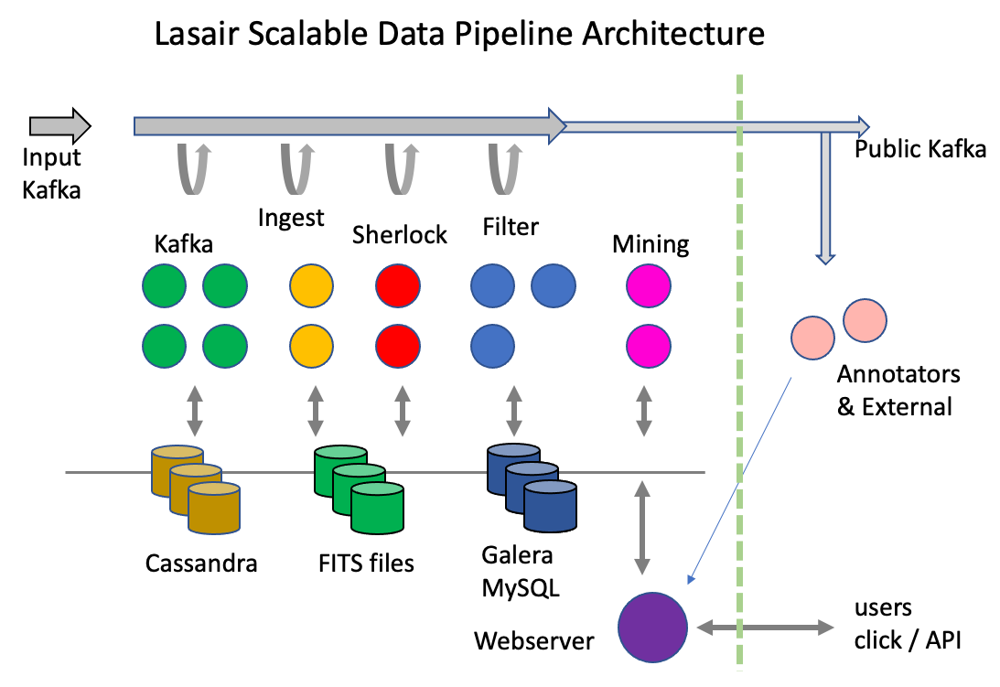

The Rubin Observatory will provide unprecedented temporal resolution, depth and uniform photometry over an entire hemisphere, along with a real-time stream of alerts from the ever changing sky. To extract the scientific potential from that stream, the community needs brokers that offer the ability to filter, query, and manipulate the alerts, and combine them with external data sources. The LSST:UK consortium has been building just such a broker (Lasair), alongside an International Data Access Centre (IDAC), building on its strengths and heritage in leading astronomical surveys, data processing and analysis. We have always expected that Lasair will be of enormous value to the worldwide community, not just to the the UK consortium, and indeed, the UK community is now embedded within the LSST Science Collaborations. This submission is our formal proposal for Lasair to make that aspiration a reality by being accepted as a Community Broker and receiving the full stream.

## The Lasair approach
**Lasair is a platform for scientists to make science; it does not try to make the science itself.**
Every LSST broker aims to filter the stream, but Lasair does this differently. Rather than scientists making python code that needs to be vetted, Lasair offers direct access with a staged approach: scientists can start with a simple, immediate mechanism using familiar SQL-like languages. These SQL-like queries can be custom made or users can choose and modify one of our pre-built and tested queries. These queries return an initial selection of objects, based on our rich value-added data content, and users can then run their own local code on the results. Users can build up to running  their own code on both the stream and the database with high-throughput resources in the IRIS cloud. The SQL filters and code can be made public, shared with a group of colleagues, copied, modified.
SQL filters can be escalated from static (run on command) to streaming filters, that run whenever new alerts arrive. A broad overview of the Lasair design is given in Figure 1.

## How Lasair Works
Lasair runs in the
UK science cloud called [IRIS](https://www.iris.ac.uk/), at the Advanced Computing Facility 
near Edinburgh, Scotland. 

Lasair ingests data with a pipeline of clusters: each cluster does a different job, some more compute/data intensive than others, so it is difficult to know a priori how much resource should be allocated to each. Our design gives flexibility: each cluster can be grown or reduced according to need. Also, there are various persistent data stores, again, each is driven by a resilient cluster that can be grown or reduced according to need. Figure 1 shows the concept: data enters the Kafka system on the left and progresses to the right. The green cluster reads, processes, and puts different data into the Kafka bus; as soon as that starts the yellow cluster pulls and pushes; eventually the whole pipeline is working. The clusters may also be reading and writing the data stores.
We also include the web and annotator nodes in this picture (bottom and right), as well as the mining nodes, although they are not part of the data ingestion pipeline. The web server nodes support users by delivering web pages and responding to API requests. The annotator nodes may be far from the Lasair computing centre and not controlled by us, but they are in this picture because just like the others, they push data into the data storage and may read from Kafka.

The Kafka system is represented by the green nodes in Figure 2 as well as the grey arrow at the top. It is responsible for reading and caching the alert packets from the USA, as well as sending it to the compute nodes and receiving their resulting packets.

The Ingest nodes read the original alerts alerts from the Kafka system, and puts the cutout images in the shared filesystem, the recent lightcurve to NoSQL (Cassandra) database, then reformats the alert as JSON – since there is no binary content – then pushes that into the Kafka system. 

Each Sherlock node has a SQL database of 5 Tbytes of astronomical sources from ~40 catalogues. The sky position of the input alert is used to intelligently decide on the most likely associated source from the catalogues, finding out, for example, if the alert is associated with a known galaxy, or if the alert is a flare from a known CV (cataclysmic variable). 

Each filter node computes features of the 30-day light curve that comes with the alert (a year with LSST), as well as matching the alert against user-made watchlists and areas. Records are writen to a local SQL database onboard the node for the object and features, the Sherlock data, the watchlist and area tags. Other tables have already been copied into the local database from the main SQL database (see Background Services below). After a batch of perhaps 10,000 alerts are ingested to the local database, it can now execute the user-made queries and push out results via the public Kafka system – or via email if the user has chosen this option. The tables in the local database are then pushed to the main SQL database and replace any earlier information where and object is already known. Once a batch is finished, the local database tables are truncated and a new batch started.

The Lasair webserver and API server allow users to control their interactions with the alert database and the stream. They can create a watchlist of their interesting sources, and Lasair will report crossmatches with members of the watchlist. They can define regions of the sky, and Lasair will report when alerts fall inside a region. They can define and save SQL queries that can run in real time as filters on the alert stream.

The Lasair API supports annotation: a structured external packet of extra information about a given object, that is stored in the annotations table in the SQL database. This could be, the result of running a machine-learning algorithm on the lightcurve, the classification created by another broker, or data from a follow-up observation on the object, for example a link to a spectrum. Users that put annotations into the Lasair database are vetted, and administrators then make it possible. That user will run a method in the Lasair API that pushes the annotation: all this can be automated, meaning the annotation may arrive within minutes of the observation that triggers it.

## ZTF and LSST
The Lasair project splits into two: the existing working version, Lasair-ZTF, that has been ingesting and exposing alerts from the ZTF survey for two years; and the future version Lasair-LSST, which is being developed based on the lessons learned from Lasair-ZTF. We are keeping the essentials of the user interface of Lasair-ZTF (static and streaming SQL queries, full database access, watchlists, classification and annotation), but are rebuilding the backend architecture for LSST event rates, using parallel services and scalable software.

Lasair-LSST is part of the funded LSST:UK project and so has access to significant UK computing infrastructure and is being developed within the UK's IDAC. Development of Lasair-LSST has guaranteed funding until 2023, with the option to apply for extension. Selection as a community broker would of course significantly enhance the probability of longer-term funding success.  

In the timeframe beyond the first data releases of LSST, we can expect continuing change. New surveys will come on line, new robotic follow-up systems, and new classification systems will proliferate, leading to more real-time transient streams and derived information. Just as cross-matching of static catalogues has gained importance in the last years, so *dynamic* cross-matching will become an engine of discovery: those transients observed by A and B, or classified in contradiction by C and D. While the bulk of data will continue to be dominated by Rubin data, there will be a deluge of metadata and tagging. Lasair will be well-suited to this challenge, building on our existing mechanisms for dynamic cross-match (e.g. the IAU's Transient Name Server) and utilising our flexible schema system. Lasair will add new tables and schemas to our databases, and build information systems to make it easy for scientists to navigate the deluge of metadata.

## Scientific goals of Lasair
We aim to facilitate all four science themes of LSST within the Lasair platform: Dark Matter and Dark Energy, the Solar System, the Changing Sky, and the Milky Way. We will do this by providing combined access to the alerts, to the annual data releases, and to external data sources, and by providing a flexible platform which creative users can adapt to their own ends. Design of Lasair is driven by a detailed Science Requirements Document which is available on request. We will have a review with broader international input if we are selected. Below we explore the issues arising from key science topics.

### Extragalactic Transients
Luminous transients outside our own galaxy include supernovae, kilonovae, tidal disruption events and AGN flare activity, nuclear transients of unknown origin, gamma-ray bursts, stellar mergers, white dwarf - NS/BH mergers, super-luminous supernovae and fast blue optical transients. 
These have timescales from hours (GRB afterglows), days (kilonovae and WD-NS/BH mergers), to weeks (supernovae, fast blue optical transients), months (TDEs, SLSNe, AGN activity) to years (SLSNe at high redshift, AGN and nuclear transients, SNe from CSM interaction). 
All of this science requires lightcurves, links to galaxy and redshift catalogues, precise astrometric cross-matching, correlation with high energy information, multiwavelength cross-matching and our concept of ``tagging'' which we introduce here. Objects need to be found on timescales of minutes to years due to the intrinsic timescale, which is mostly driven by the mass ejected by the transients (through photon diffusion time).  Some scientific highlights that Lasair will enable are : 

### Kilonovae and gravitational wave sources
Users will be able to select their own candidates by combining colour, lightcurve evolution, host galaxy information and any multi-wavelength coincidences using SQL, kafka filtering, or the Lasair API (see section 4). This can be used to enable searches for all ``fast-transients'' of timescales of minutes to days (e.g. GRB afterglows, orphan afterglows, WD-NS/BH mergers).  For some example papers of fast transients selected with Lasair data, including the first candidate WD-BH merger - see \cite{McBrien2019,Gillanders2020,Prentice2020}.  We are working with the Science Collaborations TVS and DESC on further science requirements. 

### Massive samples of supernovae 
Lasair will link all transients to a list of likely host galaxies together with their photometric redshifts and their spectroscopic redshifts, should they exist. We are working closely with the two major ESO projects that will provide tens of thousands of spectra for LSST supernovae. 
We will coordinate SN discoveries in Lasair with spectra from the 4MOST multi-fibre spectrometer on the ESO VISTA telescope. 
We will provide DESC with the ability to select 35,000 live transients for spectra and obtain spectra of 70,000 host galaxies in the TiDES (Time Domain Extragalactic Survey). 
%This will provide the largest cosmological sample of type Ia SNe, together with a massive statistical sample to understand supernova explosion physics across a range of redshifts and host galaxy masses and metallicities. Lasair will provide both (reproducible) selection and extract the scientific content (type, phase, redshift etc) to re-ingest into the broker for user exploitation. 
We are also working closely with the UK team responsible for the science software infrastructure behind SOXS on ESO's New Technology Telescope.  This is a 0.35-2$\mu$m spectrometer and ESO are fully dedicating the NTT to time domain science, with the schedule being run by the SOXS consortium. 
%We will enable the SOXS marshall and rapid data analysis pipeline to interface with Lasair, to select LSST transients ($\sim$ few$\times10^{3}$) for classification and re-ingest the information and public data for all users to access. 

### AGN, TDEs and long lived transients
Similar to the above, we will allow users to select known AGN, upload their own AGN catalogues, and select flaring events in both active and passive galaxies. This will support the science of tidal disruption events, changing look quasars, AGN flares, microlensing of background QSOs by foreground galaxies, and unusual long lived nuclear transients. Lasair will match radio and X-ray archival data with optical spectra, and the LSST lightcurves. Users will be able to select on these criteria or upload their own watch list to Lasair to combine with lightcurve parameters. 

### Milky Way and Local Group stellar transients
Within the TVS Science Collaboration most science for variables (typically recurrent and periodic signals) will be achieved with the annual data releases. However there is great opportunity in combining alerts with the data releases. Users can discover outbursts or large amplitude variability through the alerts and link to the data releases and full multi-year lightcurves. Lasair-ZTF currently can provide streams of objects matched to known stars (via watch lists of $10^6$ objects) and trigger on a particular magnitude variability index. We are working with scientists within TVS in particular to define features that can be measured on the incoming stream and used to provide alerts.  For example, outbursts of AM CVn stars\cite{AMCVn} which are then linked to the binary system's long term lightcurve (SDSS J1240-0159 is a recent example). Lasair-LSST will expand on its current functionality to provide seamless cross-links to the data releases within the UK IDAC infrastructure. 

### Solar System objects
LSST will provide an unprecedented opportunity for time-domain Solar System science.

### New types of transient
In the future, we can expect surprises. The Lasair community has  active groups 
dedicated to finding and following rare events such as superluminous supernovae, tidal disruption events, compact stellar mergers and black-hole forming supernovae.  
In the future we expect further exotica to emerge, and it is the flexibility of Lasair's design which will allow relevant information to be streamed in, joint queries to be built and executed in real time, and follow-up facilities alerted and activated.

