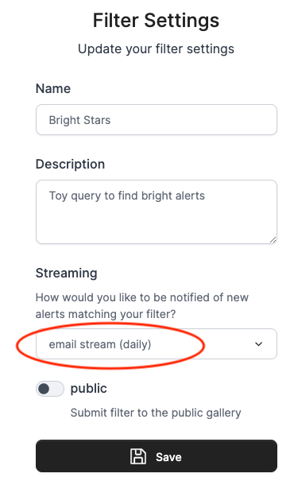
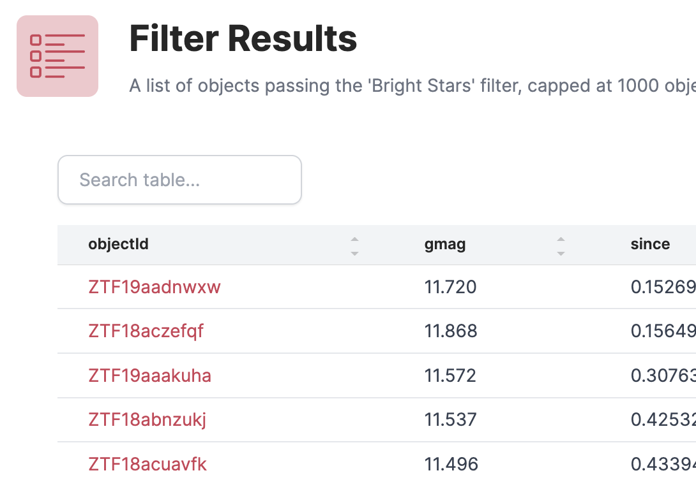
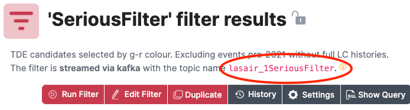

## Alert Streams

The Lasair broker can send immediate “push” notifications when your active query/filter sees and interesting alert. Here is how to make that happen with email notification. First make sure you are logged in to your Lasair account (top left of screen, then go to create new stored query. This page is about how to get email alerts from your active query; the process is very similar for Kafka alerts, except that you will fetch the results by machine instead of by email.

### Resources
- See the "fetch_kafka" notebook in the [Lasair API Examples notebooks](https://github.com/lsst-uk/lasair-examples/tree/main/notebooks/API_examples).
- See the [Lasair Marshall Notebook](https://github.com/lsst-uk/lasair-examples/tree/main/notebooks/marshall).
- Watch the video [Topic and GroupID for a Lasair Kafka Stream](https://youtu.be/HJneKr1EhmY).

### Streaming Filters

You will need to be logged in to your Lasair account. Make a filter as in the
previous section, then click “Save". You will then be prompted for "Filter Settings", which you can fill in like this:


Nothing will happen immediately. You can run the query in the usual way from the web browser, but you will have to wait for some alerts to arrive before your active query will be triggered. Once that happens, you will get an email at the address you used to create your account. Something like the message shown here. Note that the attributes you chose above are reported (objectId, gmag, since), together with the UTC time at which the alert was triggered.

The email distribution is intended for filters that do not pass many alerts 
in a given day, or else the email box will be flooded with spam. Lasair throttles
the number of emails; once the first has been sent, another willnot be sent until 24
hours later, containing the objects passed by the filter in that time. In this 
way, a maximum of one email per day can come from a Lasair filter.



### Kafka Streams

While there are many methods to handle emails automatically, they are complex and beset with problems. 

Therefore Lasair also provides a protocol for immediate delivery that is more suitable for machines to communicate with machines. It is called Kafka.
By providing Kafka streams, Lasair provides a machine-readable packet of data that can cause action at your site. 
While this can be done with the email channel, it is awkward. To convert your filter from email to kafka, bring 
choose the filter, then click the Settings button, and change the streaming option to 'kafka stream'.

*   We recommend [Confluent Kafka](https://pypi.org/project/confluent-kafka/), the python install being `pip install confluent_kafka`.
*   You will be connecting to kafka.lsst.ac.uk on port 9092

You will need to understand two concepts: Topic and GroupID. 

*  The Topic is a string to identify which stream of alerts you want, which derives from the name of a Lasair streaming query. 
*  The GroupID tells Kafka where to start delivery to you. It is just a string that you can make up, for example "Susan3456". The Kafka server remembers which GroupIds it has seen before, and which was the last alert it delivered. When you start your code again with the same GroupID, you only get alerts that arrived since last time you used that GroupId. If you use a new GroupID, you get the alerts from the start of the Kafka cache, which is about 7 days.

You can find the topic that corresponds to your filter in the detail page, shown here in the red oval:



The topic name is a combination of the string "lasair_", the ID number of your user account, and
a sanitised version of the name you gave the filter. Therefore if you edit the filter and change its name, 
the topic name will also change.

For testing purposes, the `group_id` will change frequently, and you can get all of the alerts
the come from the given stream. Then you will set up your program to run continuously,
perhaps in a `screen` session on a server machine, or started every hour by `cron`. 
In this case, the `group_id` should remain constant, so you won't get any alerts twice.

Here is the sample code
```
import json
from lasair import lasair_consumer

kafka_server = 'kafka.lsst.ac.uk:9092'
group_id     = 'test123'
my_topic     = 'lasair_2SN-likecandidates'
consumer = lasair_consumer(kafka_server, group_id, my_topic)
import json
n = 0
while n < 10:
    msg = consumer.poll(timeout=20)
    if msg is None:
        break
    if msg.error():
        print(str(msg.error()))
        break
    jmsg = json.loads(msg.value())
    print(json.dumps(jmsg, indent=2))
    n += 1
print('No more messages available')
```
