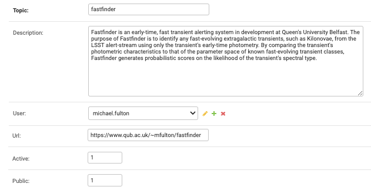

## Making an Annotator

### Request to Lasair team
Annotation means that external users push information to the Lasair database.
Therefore it requires that user to inform the Lasair team and be approved
before it will work. The team will use the admin interface to create an `annotator`
object in the database, which is a conneciton between the API token of that user
with the name (`topic`) assigned to the annotator. Here we see that admin interface:



You can see that your new annotator is a name (or *topic*) and description. 
It is bound to your own Lasair account, meaning that you must use your own API token 
to run your annotator code (see below). There is also a URL for further information.
If the annotator is `active`, it can receive annotations, meaning that if the external system
goes wild, the annotator can be switched off by setting `active=0`. Finally, the annotator
can be `public` or not, meaning that it is visible or not to others building Lasair filters.

### Make the code
The following code reads the stream from a Lasair filter, and for each `objectId`, 
it pulls the complete object information so it could analyse the lightcurve 
and other information before making a classification decision. 
This information is collected up as the annotation and sent back to Lasair,
where it will be available for others to query.

There should be a file `settings.py` file to accomany the code below with these variables defined::

   * `TOPIC_IN`: The name of your streaming query as seen in the filter detail, where it says "The filter is streamed via kafka with the topic name"
   * `GROUP_ID`: Choose a new one evey run when testing; keep it constant for long-term running
   * `API_TOKEN`: As found in 'My Profile' top right of the web page
   * `TOPIC_OUT`: The name of your annotator as agreed with the Lasair team (above)

If the code below is not clear, it would be good for you to read about how 
the (Lasair client)[rest-api.html] works.

For more information about what is returned as `objectInfo`, a complete example 
is [shown here](ZTF23aabplmy.html).

For testing purposes, the `GROUP_ID` will change frequently, and you get all of the alerts
the come from the given stream. Then you will set up your annotator program to run continuously,
perhaps in a `screen` session on a server machine, or started every hour by `cron`. 
In that case, the `GROUP_ID` will remain constant, so you won't get any alerts twice.

A much simpler code is possible if for example the annotation is the classification
results from another broker. In that case, only the call to `L.annotator()` is necessary.

```
import json, sys, settings
import lasair

# This function deals with an object once it is received from Lasair
def handle_object(objectId, L, topic_out):
    # from the objectId, we can get all the info that Lasair has
    objectInfo = L.objects([objectId])[0]
    print(objectInfo.keys())
    if not objectInfo:
        return 0
    # objectInfo.keys():
    #  -- objectData: about the object and its features
    #  -- candidates: the lightcurve of detections and nondetections
    #  -- sherlock: the sherlock information
    #  -- TNS: any crossmatch with the TNS database

    # analyse object here. The following is a toy annotation
    classdict      = {'fruit': 'apple'}
    classification = 'ripe'
    explanation    = 'another nice apple'

    # now we annotate the Lasair data with the classification
    L.annotate(
        topic_out, 
        objectId, 
        classification,
        version='0.1', 
        explanation=explanation, 
        classdict=classdict, 
        url='')
    print(objectId, '-- annotated!')
    return 1

#####################################
# first we set up pulling the stream from Lasair
# a fresh group_id gets all, an old group_id starts where it left off
group_id = settings.GROUP_ID

# a filter from Lasair, example 'lasair_2SN-likecandidates'
topic_in = settings.TOPIC_IN

# kafka consumer that we can suck from
consumer = lasair.lasair_consumer('kafka.lsst.ac.uk:9092', group_id, topic_in)

# the lasair client will be used for pulling all the info about the object
# and for annotating it
L = lasair.lasair_client(settings.API_TOKEN)

# TOPIC_OUT is an annotator owned by a user. API_TOKEN must be that users token.
topic_out = settings.TOPIC_OUT

# just get a few to start
max_alert = 5

n_alert = n_annotate = 0
while n_alert < max_alert:
    msg = consumer.poll(timeout=20)
    if msg is None:
        break
    if msg.error():
        print(str(msg.error()))
        break
    jsonmsg = json.loads(msg.value())
    objectId       = jsonmsg['objectId']
    n_alert += 1
    n_annotate += handle_object(objectId, L, topic_out)

print('Annotated %d of %d objects' % (n_annotate, n_alert))
```
