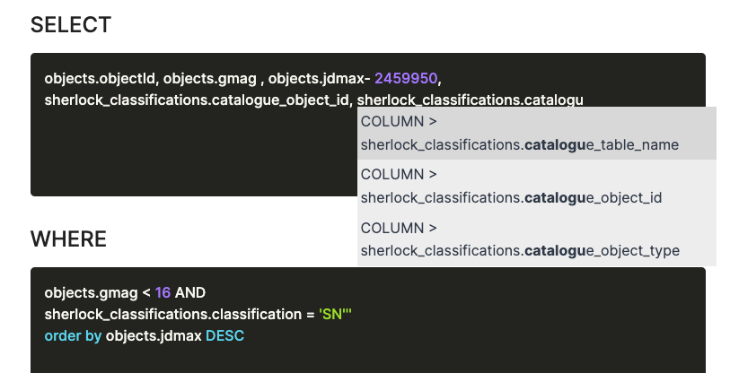
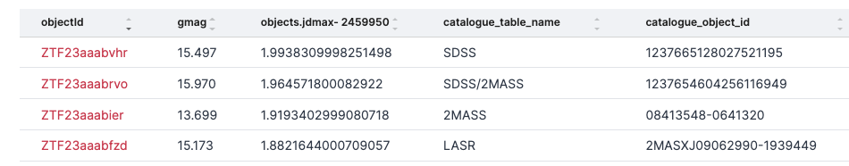
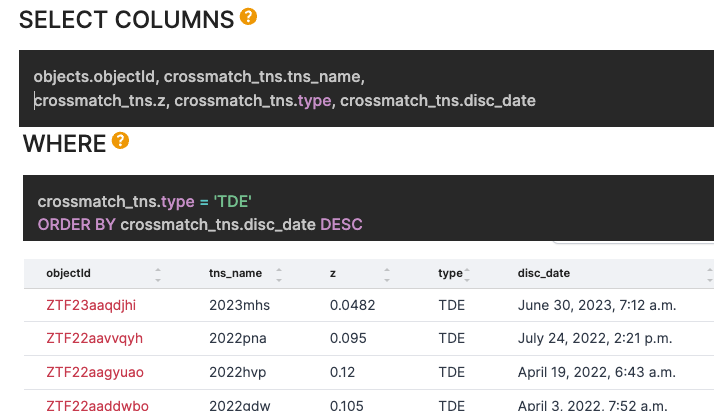
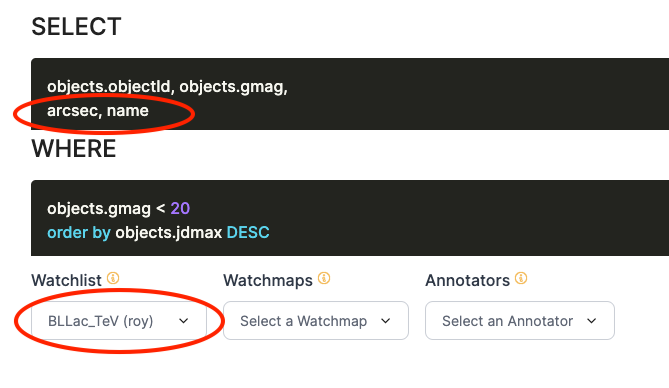
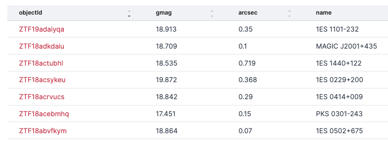
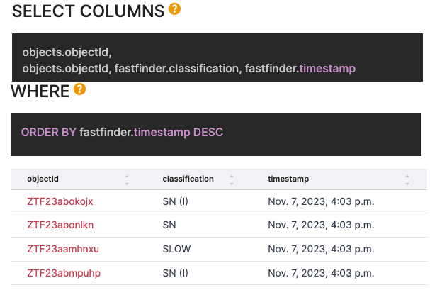
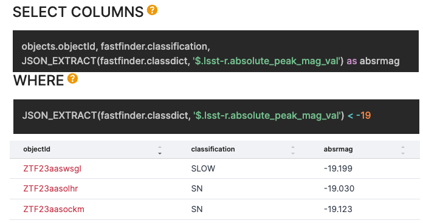

## Make a Lasair Filter

Lasair is built around "filters" of the alert stream. Users create a filter with SQL clauses, based on the
attributes of the object associated with the alert: its lightcurve, sky context, etc.
First you make a filter and run it on the previous alerts, and then you can save the filter
(if you have a Lasair account). You can convert your filter to a *streaming* filter, so that results
are sent to your email or to your own machine as soon as they are available.

Let us make a filter for alerts associated with bright stars. Click on "Filters" in the left margin, 
then "Create New" at top right.


Fill in the form as shown here. Name and description, then check the “email” box, and fill in the SELECT as
```
objects.objectId, objects.gmag, jdnow()-objects.jdmax AS since
```
and fill in the WHERE as
```
objects.gmag < 12
```

If you click "Run Filter", all the objects will be returned that are brighter than
12th magnitude and the brightness is variable.

Perhaps you would like to see the obejcts with the most recent alerts first:
just add to the WHERE clause the phrase
```
ORDER BY objects.jdmax DESC
```
and click "Run Filter" again. The attribute `jdmax` of an object is the Julian Day 
of the most recent detection of that object.

A good way to understand how filters are made is to browse those in the Public Gallery.

Looking at the Lasair Schema Browser, there are several additional tables that you can use in addition to the `objects` table:

   * `sherlock_classifications`: the sky context. 
   * `crossmatch_tns`: the crossmatch with the Transient Name Seerver.
   * A watchlist of your choice, either your own or one from the public gallery
   * A watchmap of your choice, either your own or one from the public gallery
   * An annotator of your choice, either your own or one from the public gallery

### Copying a Filter
An easy way to get started with building a filter is to copy an existing one; either your own or
from the public gallery. You will be asked to provide a name for the new filter, which 
should be different from the original. You can then modify the SQL code and save it.

### Filtering on Sky Context
Once you start typing into the SELECT or WHERE boxes, the autocomplete function
is activated. For example if you want to know the host galaxy associated
with an object, you type 'sherlock' and the options show -- the grey box below.



The name of the galaxy is the `id` and the catalogue table name to which
that `id` applies. Here are some sample results fromn the query above:



The TNS table `crossmatch_tns` operates in a similar way to the `sherlock_classifications` table. 
You can, for example, find all the recent Tidal Disruption Events that coincide with ZTF alerts, 
with redshift and the latest first:



See the Schema Browser for details of the available attributes.

### Filtering on a Watchlist/Watchmap
You can select on objects coincident with a watchlist, either your own
or one from the public gallery. At the bottom of the filter creation form
is a selection of watchlists (red oval below). You can then also 
choose the attributes `name` and `arcsec`, the name and angular distance of the
coincident source from the watchlist.



The results might look something like this:



The watchmaps operate in a similar way with the selection box, but there are no 
attributes available.

### Filtering on an Annotator

When an annotation is uploaded to Lasair, it belongs to a specific object,
and it has attributes:

   * `topic`: the name of the annotator, generally associated with a specific user who is responsible.
   * `classification`: a short string drawn from a fixed vocabulary, eg "kilonova".
   * `explanation`: a natural language explanation of the classification, eg “probable kilonova but could also be supernova”
   * `classdict`: the annotation expressed as a JSON dictionary
   * `url`: a URL where more information can be obtained about the classification of this object

Here for example, we utilise an annotator called `fastfinder`, to see the classification and 
timestamp, with the latest at the top of the listing:


The `classdict` is a bit more complicated, because it is a schema-free collection of data
as chosen by the implementor of the annotator. In the case of `fastfinder`, a typical `classdict`
is:
```
{
    "lsst-g": {},
    "lsst-r": {
        "absolute_peak_mag_val": -19.116,
        "absolute_peak_mag_err": 0.149,
        "overall_decline_rate_val": 0.072,
        "overall_decline_rate_err": 0.045
    },
    "in-major-body": {
        "Galactic Plane": "N",
        "M31": "N"
    }
}
```

We can SELECT on these values, as well as use them for the WHERE clause, with a SQL clause like this:
```
SELECT
objects.objectId,
JSON_EXTRACT(fastfinder.classdict, '$.lsst-r.absolute_peak_mag_val') as absrmag
WHERE
JSON_EXTRACT(fastfinder.classdict, '$.lsst-r.absolute_peak_mag_val') < -19
```
with a result as shown below

