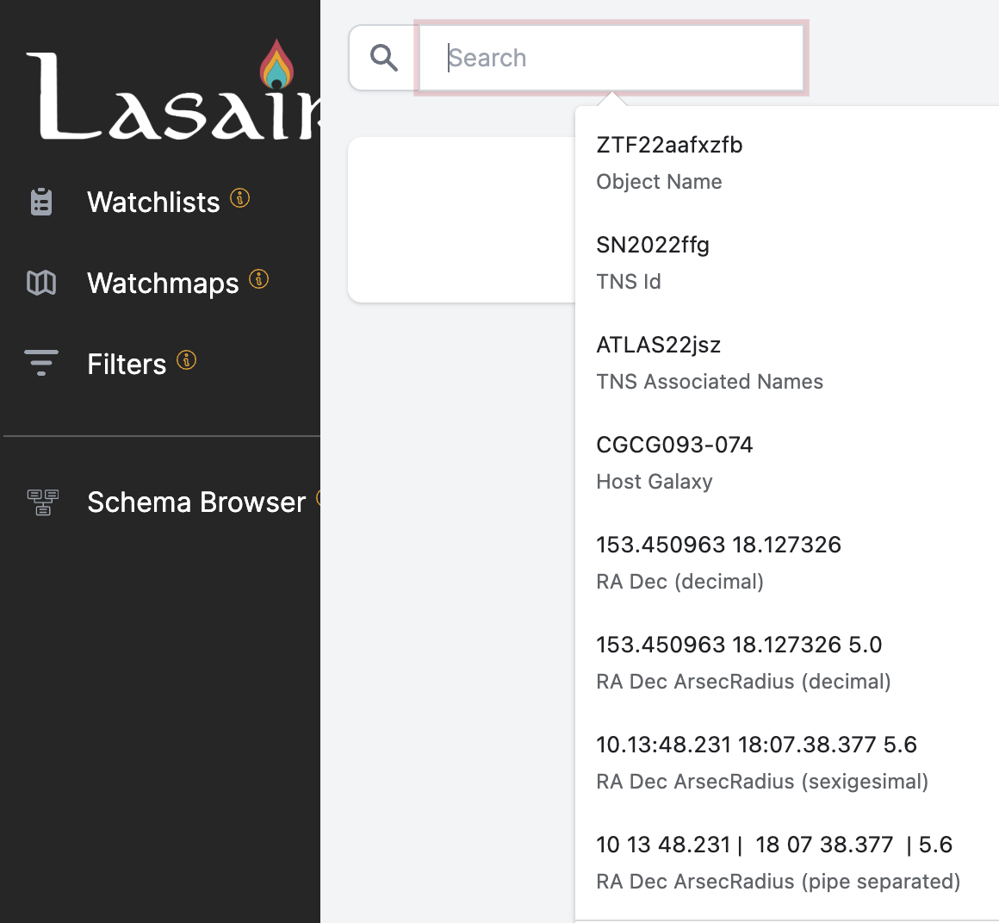

# Sky Search

## The Search Bar

At the top of every Lasair page is a form that can be filled in to do a search 
on the sky. You can enter several different kinds of search term, as illustrated
in the screenshot above:

- A Lasair object name

- The name of an entry in the 
<a href=https://www.wis-tns.org/>Transient Name Server (TNS)</a>, for example 
<a href=https://www.wis-tns.org/search?name=SN2022ffg>SN2022ffg</a>

- The name of a host galaxy, that can be searched in the 
<a href=https://ned.ipac.caltech.edu/>NED database</a>, for example
<a href=https://ned.ipac.caltech.edu/cgi-bin/objsearch?objname=CGCG093-074>CGCG093-074</a>.

- Right ascension and declination in J2000 frame:

    - As decimal degrees, for example 141.15725 25.39508,

    - As decimal degrees with a search radius in arcseconds, for example 141.15725 25.39508 10,

    - As sexagesimal, for example 10:13:48.2 18:07:38.3

    - As sexagesimal with a search radius in arcseconds, for example 10:13:48.2 18:07:38.3 10
