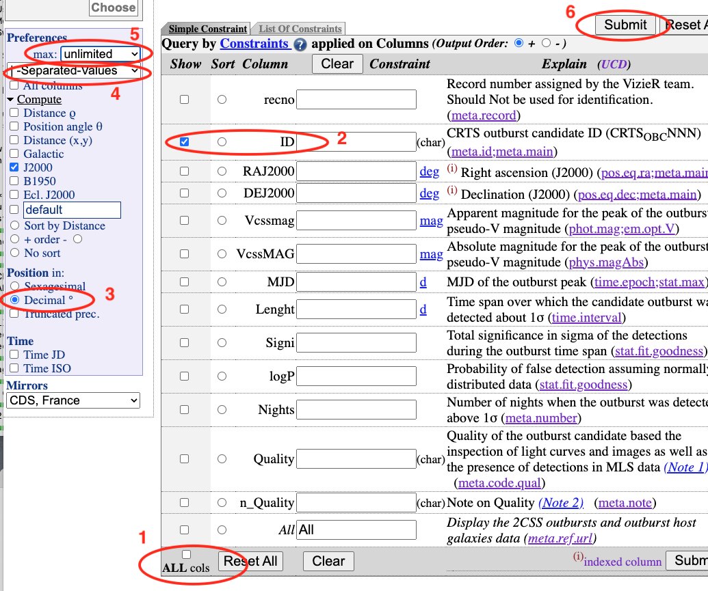
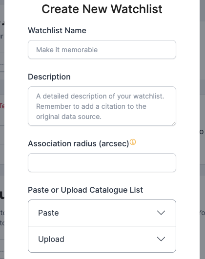

# Watchlists

**Easter Egg for Roy**



A watchlist is a set of points in the sky, together with a radius in arcseconds, which 
can be the same for all sources, or different for each. 
It is assumed to be a list of "interesting" sources, so that any transient that 
falls within the radius of one of the sources might indicate activity of that source. 
Each user of the Lasair system has their own set of watchlists, and can be 
alerted when a transient is coincident with a watchlist source. Here, the word coincident means
within the radius of the source.
An "Active" watchlist is one that is run every day, so that it is up to date with the latest objects.

## Create new watchlist

You can create a watchlist of sources by preparing a text file, where each 
comma-separated or |-separated line has RA and Dec in decimal degrees, 
an identifier, with optional radius in arcseconds. One way to do this is 
with [Vizier](http://vizier.u-strasbg.fr/viz-bin/VizieR) (see below) or with a spreadsheet 
program such as Excel or Numbers. 

Here is [an example of the data](https://lasair-ztf.lsst.ac.uk/lasair/static/BLLac.txt). The 42 entries are _BL Lac candidates for TeV observations (Massaro+, 2013)_

Note that you must be logged in to create a watchlist.

Many astronomers are interested in transients that are associated with specific 
astronomical objects, perhaps active galaxies or star formation regions. 
Once you have an account on Lasair, you can create any number of watchlists, to be 
used in the query engine. To be specific, suppose we are interested in the 42 objects in the 
catalogue BL Lac candidates for TeV observations (Massaro+, 2013), 
that can be found in the Vizier library of catalogues. You can make your 
watchlist “public”, so other Lasair users can see it and use it in queries, 
and you can make your watchlist “active”, meaning that the crossmatch (see below) 
is done automatically every day.

The following is how to make the corect file format from [Vizier](http://vizier.u-strasbg.fr/viz-bin/VizieR).

Once you have selected your catalogue,

1. Deselect all the columns

2. Select a column that can act as the identifier for each source. 
These need to be unique and not empty: if not, you must edit the resulting file to make it so.

3. Choose “Decimal” for the coordinates

4. Choose “|-separated” for the format

5. Click submit to download the file.

Once you have the file, you can paste it into a form, or upload the file directly.
The upload form is shown here:

Fill in the name and description of the watchlist. Choose a default value of the 
radius to use in matching, in arcseconds. 
Each line should be RA, Dec, ID, and may have a fourth entry, the radius to use in matching, 
in arcseconds, if different from the default. Then click “Create”.

Here is a successful creation of a watchlist. Some messages – “Bad line” – because there were 
some lines without data, but you can ignore these, and look for where it 
says “Watchlist created successfully”. You can now find it in the list of “My Watchlists”.

## Find outbursts from my watchlist

Once you have made a watchlist, you may be interested in being notified whenever 
something unusual – outburst for example – happens to one of your sources. 
Thus we combine a watchlist with a query on magnitude that detects fast rise. 
For the watch list see Build a Watchlist of your sources, and for the query we 
utilise the moving averages of apparent magnitudes that Lasair provides. 
