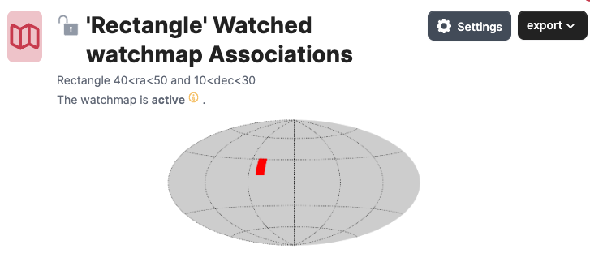
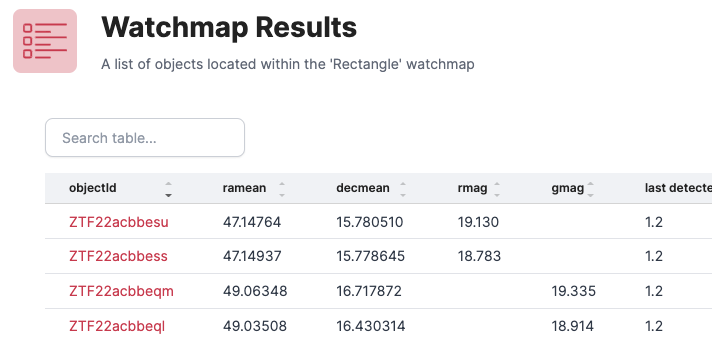
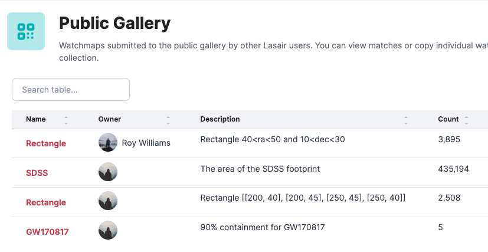
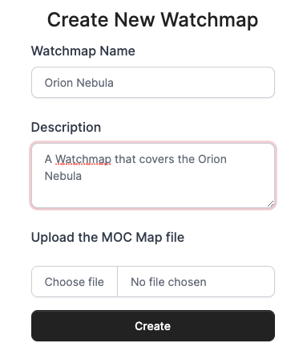

# Watchmaps (Sky Regions)

## What is it?

A watchmap is a specification of an area of the sky, that can be used as part of a Lasair filter.
An example might be the footprint of another survey, or the area of sky where a multimessenger 
event occured. If the watchmap has been set to "active", then all alerts ingested to Lasair are tested 
against it, and tagged if inside the watchmap. A filter can then be built that selects only
alerts falling inside the watchmap.



Above we see a simple watchmap displayed as a 
[Mollweide projection](https://en.wikipedia.org/wiki/Mollweide_projection)
on the sky. It is a rectangle of sky with vertices (40,10), (50,10), (50, 30), (40,30).
The watchmap can also have a name and description, accessible from the "settings" button. 
Also here, the owner can choose for the watchmap to be public or not, 
and for the watchmap to be "active" or not.



Below the Mollweide picture of the watchmap is a partial list of the Lasair alerts that fall inside it,
together with magnitudes. The list is sorted so those observed most recently are first.



Here we see how the gallery of public watchmaps may look. Each show name, description, 
and how many alerts fall within it.

## How can I make one?

Building a watchmap starts with building a MOC file -- see the information at <br/>
[https://cds-astro.github.io/mocpy/](https://cds-astro.github.io/mocpy/index.html).




This is the dialogue to load a MOC file, in this case to cover the Orion Nebula. 
It expects to upload a MOC file.
One way to build this from python is this code:<br/>
[Create a MOC from a Concave Polygon](https://cds-astro.github.io/mocpy/examples/examples.html#create-a-moc-from-a-concave-polygon)
For the Orion Nebula, we choose a rectangle like this:
```
import astropy.units as u
import numpy as np
from astropy.coordinates import Angle, SkyCoord
from mocpy import MOC, WCS

vertices = np.array([
    [83.4, -5.0],
    [84.1, -5.0],
    [84.1, -5.7],
    [83.4, -5.7]])
skycoord = SkyCoord(vertices, unit="deg", frame="icrs")
moc = MOC.from_polygon_skycoord(skycoord, max_depth=8)
moc.write("polygon_moc.fits", format="fits", overwrite=True)
```
and we may adjust the `max_depth`: smaller values give smaller files, but larger values 
give more accurate edges. For a fluffy thing like the Orion Nebula, `max_depth=8` is quite
sufficient. The output of this program is a file called `polygon_moc.fits`, that can be uploaded.

Note that the new watchmap is by default public and active. 
It is only future alerts that will be matched against the new watchmap; however if you 
[contact us](../more_info/contact.html), quoting the URL for the watchmap, we can 
match it against past alerts.
